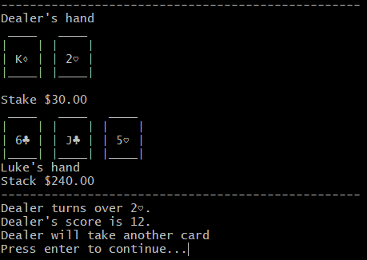
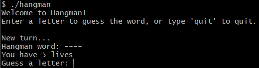
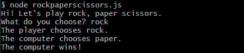
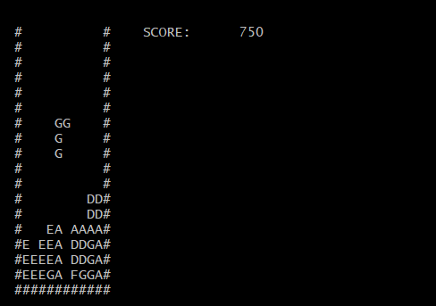
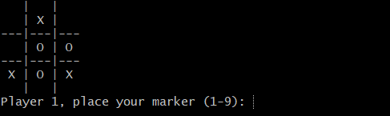

## Description

A collection of short games made to run on the command line.

### Contents
- Blackjack (Python)
- Hangman (C)
- Rock, Paper, Scissors (JavaScript)
- Tetris (C++)
- TicTacToe (Python)

## Games

### Blackjack
Play Blackjack against an AI dealer.

### Hangman
Play Hangman from a list of words loaded from a text file.

### Rock, Paper, Scissors (JS)
Play rock, paper, scissors against the computer.

### Tetris (C++)
A Tetris clone on the command line.

### TicTacToe
A two player game of TicTacToe.

