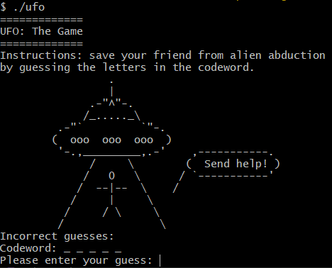

## Description

A collection of short games made to run on the command line.

### Contents
- Blackjack (`Python`)
- Hangman (`C`)
- Rock, Paper, Scissors (`JavaScript`)
- Rock, Paper, Scissors, Lizard, Spock (`C++`)
- Tetris (`C++`)
- TicTacToe (`Python`)
- UFO game (`C++`)

## Games

### Blackjack
Play Blackjack against an AI dealer.

### Hangman
Play Hangman from a list of words loaded from a text file.

### Rock, Paper, Scissors, Lizard, Spock
Play a variation of the classic rock, paper, scissors with extra options.

### Tetris
A Tetris clone on the command line.

### TicTacToe
A two player game of TicTacToe.

### UFO Game
Play a hangman clone with alien abduction.

